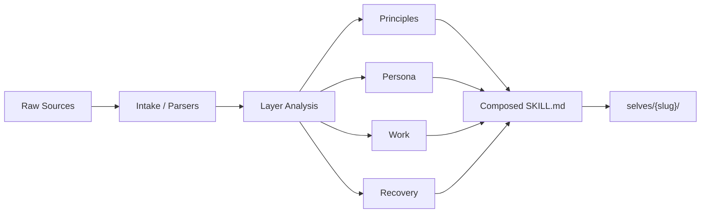

<div align="center">

# 自己.skills

**Turn your documents, notes, code, chats, and decisions into an evolving AI skill.**

[](LICENSE)
[](https://python.org)
[](https://openai.com)
[](https://claude.ai/code)
[](#)

[快速开始](#快速开始) · [支持矩阵](#支持矩阵) · [微信实验能力](#微信实验能力实验) · [Examples](#examples) · [安装](INSTALL.md)

</div>

---

## 项目定位

`自己.skills` 不是一个“人格扮演 prompt”，而是一个四层 self skill 生成器。

输入你的：

- 文档
- 代码
- 笔记
- 聊天记录
- 复盘
- 历史决策

输出一个可持续进化的 AI Skill：

- `Principles`
- `Persona`
- `Work`
- `Recovery`

默认模式是 `best`，目标不是机械复制现在的你，而是提炼你**最佳工作状态**下的稳定规则。

---

## 特性

- 四层结构固定，生成结果稳定
- 支持 `create / update / list / rollback / delete`
- 共享核心逻辑，兼容 Claude Code / OpenClaw / Codex
- 支持多来源资料输入
- 支持版本回滚
- 支持实验性的个人微信本地研究能力

---

## 快速开始

创建一个最小 self：

```bash
python3 tools/skill_writer.py --action create \
  --meta ./examples/sample_meta.json \
  --work ./examples/sample_work.md \
  --persona ./examples/sample_persona.md \
  --principles ./examples/sample_principles.md \
  --recovery ./examples/sample_recovery.md \
  --base-dir ./selves
```

列出已有 self：

```bash
python3 tools/skill_writer.py --action list --base-dir ./selves
```

回滚某个版本：

```bash
python3 tools/version_manager.py --action rollback --slug {slug} --version {version} --base-dir ./selves
```

仓库校验与冒烟：

```bash
python3 tools/validate_self_skill.py
python3 tools/smoke_test.py
python3 tools/wechat_smoke_test.py
```

---

## 支持矩阵

| 能力 | 状态 | 说明 |
|------|------|------|
| 四层 self 生成 | Stable | `Principles / Persona / Work / Recovery` |
| 版本管理 | Stable | `backup / rollback / list` |
| 飞书自动采集 | Available | 需 API / 登录配置 |
| 钉钉自动采集 | Available | 消息历史能力受限 |
| Slack 自动采集 | Available | 需管理员安装 Bot |
| 邮件 / Markdown / PDF | Stable | 手工输入路径 |
| 个人微信本地探测 | Experimental | `macOS + Windows` 骨架 |
| 个人微信本地解析 | Experimental | 可解析样本，真实库可能加密或封装 |
| 微信导出适配 | Experimental | 推荐回退方案 |

---

## 微信实验能力（Experimental）

这个项目已经带了个人微信实验工具链，但它的定位是：

- 用于 GitHub 展示和研究
- 不承诺稳定
- 不保证兼容所有微信版本
- 不支持 iPhone / Android 端本机直读
- 全程只读，不写回原始目录

### 推荐路线

1. 先 probe 本地目录
2. 再尝试 parse 本地库
3. 如果库不可读，退回导出适配

### 命令

本地探测：

```bash
python3 tools/wechat_local_probe.py --platform auto --output /tmp/wechat_manifest.json
```

本地解析：

```bash
python3 tools/wechat_local_parser.py --manifest /tmp/wechat_manifest.json --output-dir /tmp/wechat_out
```

导出适配：

```bash
python3 tools/wechat_export_adapter.py --input /path/to/export --format auto --output-dir /tmp/wechat_out
```

统一入口：

```bash
python3 tools/wechat_pipeline.py --mode local --platform auto --output-dir /tmp/wechat_out
python3 tools/wechat_pipeline.py --mode adapt --input ./examples/wechat/export --output-dir /tmp/wechat_out
```

### 推荐回退工具

- [留痕](https://github.com/greyovo/留痕) for macOS
- [WeChatMsg](https://github.com/LC044/WeChatMsg) for Windows
- [PyWxDump](https://github.com/xaoyaoo/PyWxDump) for Windows

---

## 数据流



---

## Examples

最小 self 输入样例：

- [`examples/sample_meta.json`](examples/sample_meta.json)
- [`examples/sample_work.md`](examples/sample_work.md)
- [`examples/sample_persona.md`](examples/sample_persona.md)
- [`examples/sample_principles.md`](examples/sample_principles.md)
- [`examples/sample_recovery.md`](examples/sample_recovery.md)

生成样例：

- [`examples/generated/qing-yun/SKILL.md`](examples/generated/qing-yun/SKILL.md)

微信实验样例：

- [`examples/wechat/README.md`](examples/wechat/README.md)
- [`examples/wechat/manifest.sample.json`](examples/wechat/manifest.sample.json)
- [`examples/wechat/messages.sample.json`](examples/wechat/messages.sample.json)
- [`examples/wechat/parse_report.sample.json`](examples/wechat/parse_report.sample.json)

---

## 仓库结构

```text
self-skill/
├── README.md
├── INSTALL.md
├── SKILL.md
├── prompts/
├── tools/
├── runtimes/
├── examples/
├── selves/
└── .github/workflows/
```

关键目录：

- `tools/`: writer、versioning、collectors、validators、wechat experimental tools
- `examples/`: minimal inputs, generated sample, wechat examples
- `selves/`: real generated outputs
- `.github/workflows/`: CI

---

## 当前状态

已经完成：

- 四层生成模型
- writer / version manager
- repo validate + smoke test
- runtime adaptation docs
- 微信实验工具链
- GitHub 基础包装

后续方向：

- 企微官方接入
- 更多真实导出格式适配
- 更完整的 GitHub 发布素材

---

## 开源文件

- [LICENSE](LICENSE)
- [CHANGELOG.md](CHANGELOG.md)
- [CONTRIBUTING.md](CONTRIBUTING.md)
- [SECURITY.md](SECURITY.md)

---

## 上游参考

只读参考仓库位于：

`/Volumes/M盘/codex/自己skills/colleague-skill`
